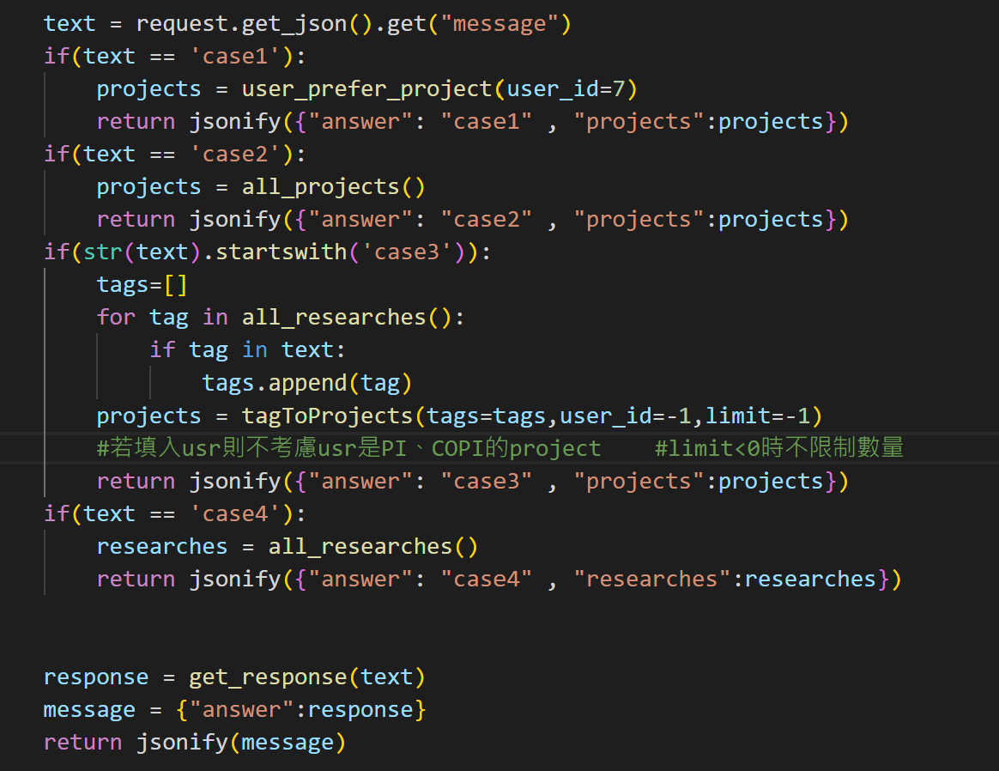
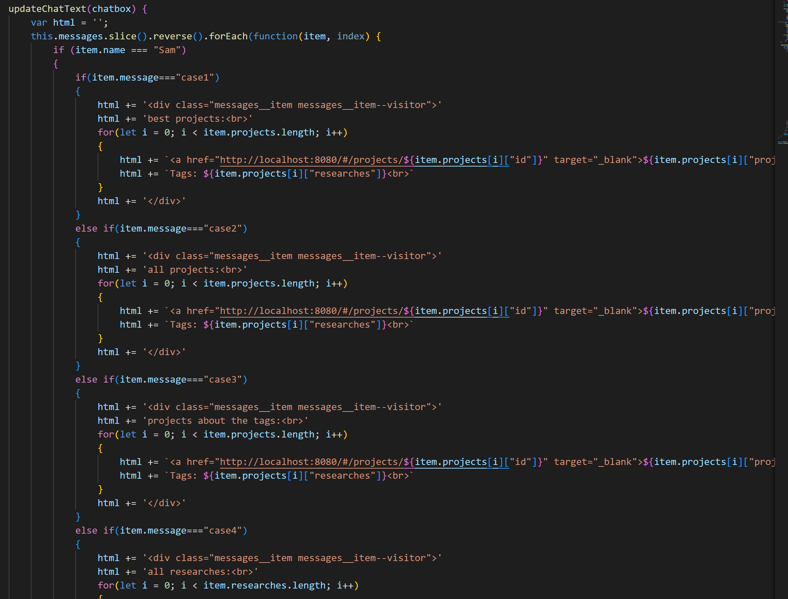

### 1215更新
我試著做了把機器人answer傳到前端，再加一點排版，\
在把昱喆的那個cahtbot嵌入能回應之後，\
改了app.js、run.py，加上database.py：
___
"\pair\ccu_ai_lab_backend\run.py"

___
"\pair\ccu_ai_lab_backend\database.py"
___
"\pair\ccu_ai_lab_frontend\ccu_ai_lab_frontend\public\app.js"

___

後端資料庫會透過jsonify(p/)把字典轉成json回傳\
字典裡面原本就有answer這個欄位，\
我在不同case額外加了增加不同欄位，\
call資料庫的function之後，\
就把回傳值放在這些欄位，\
像researches、projects。
___
\
前端收到json之後會將他轉為字典，\
就是r => r.json那，\
之後讀出裡面的欄位，\
就是let msg = { ..."message":r.answer...}那行。\
沒有讀到的部分會變Null，但判斷case之後不去用他就可以。
___

之後就可以在updateChatText那裏排版、加超連結。
___
成果：

